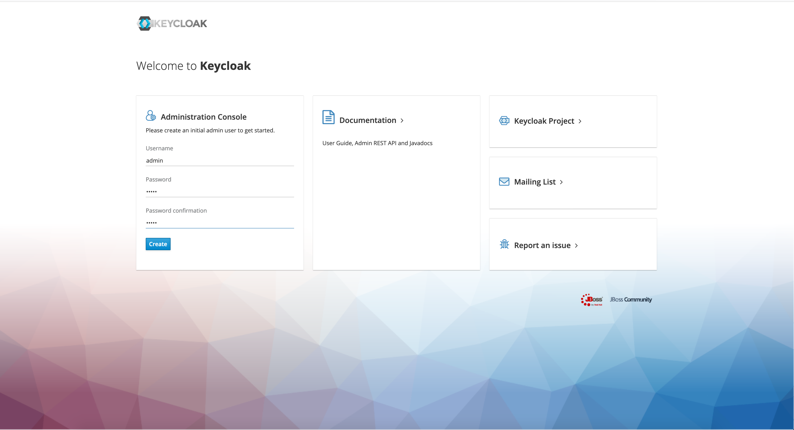
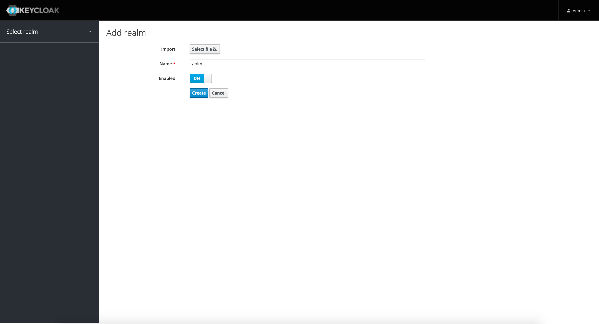
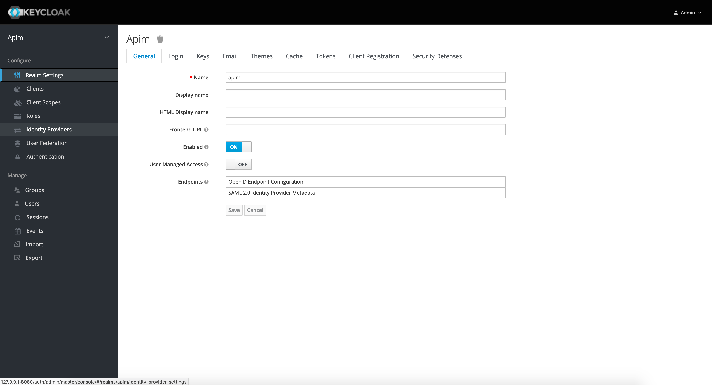
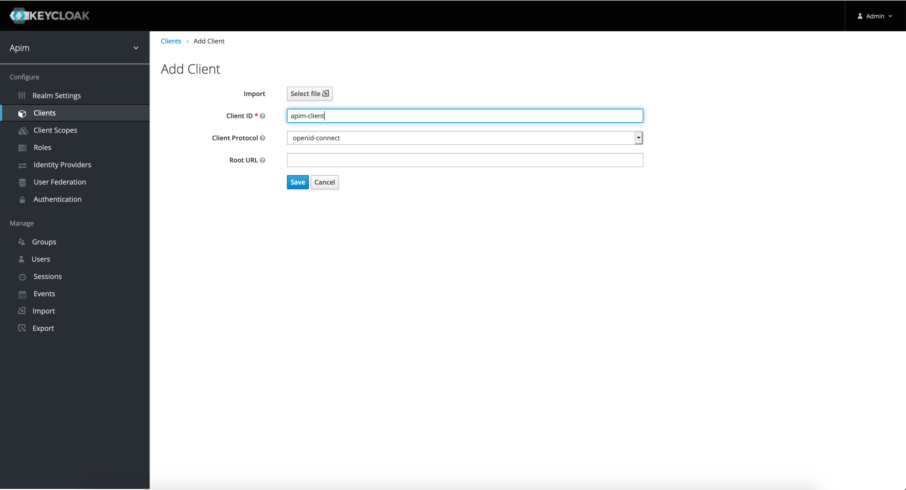
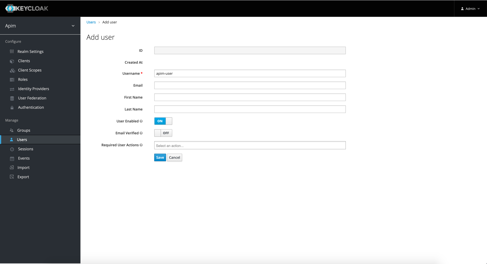
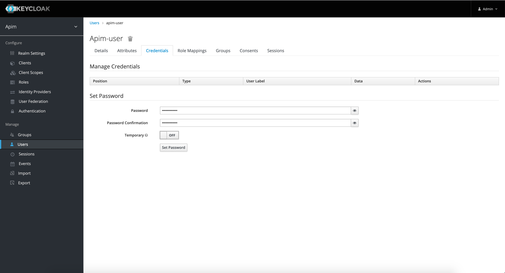
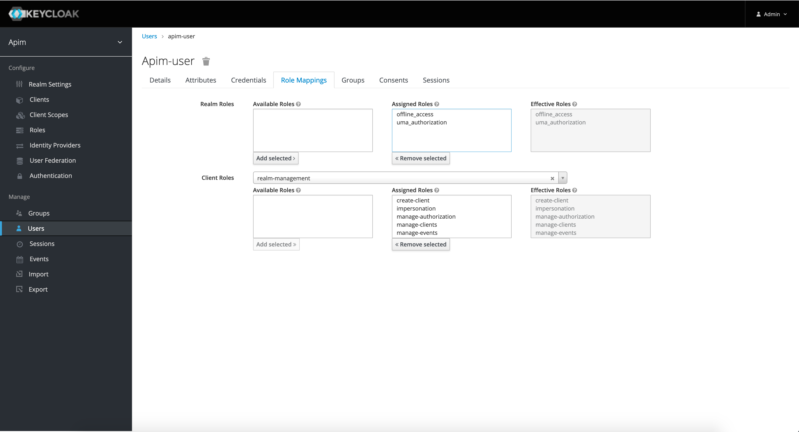
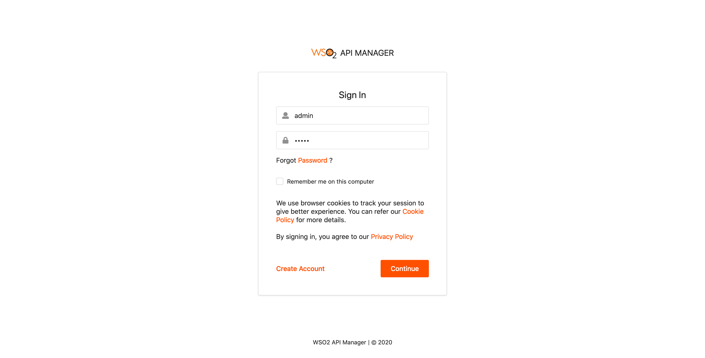
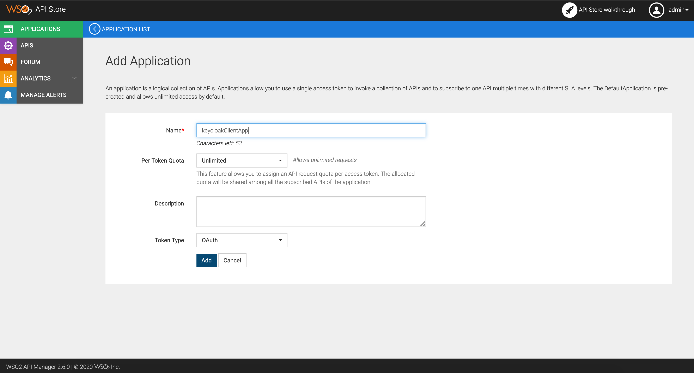
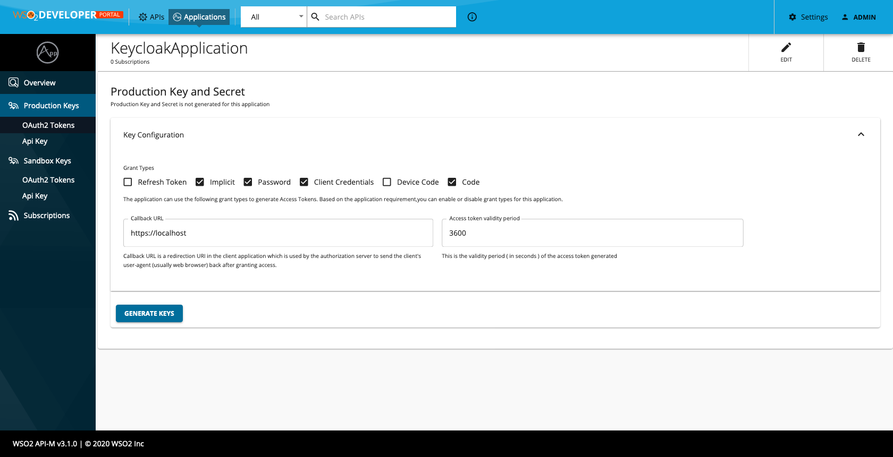

# Integrate WSO2 API Store with an external IAM using the Keycloak Open Source IAM

In this guide, we explain how to integrate the WSO2 API Store with an external Identity and Access Management server (IAM) using the Keycloak Open Source IAM to manage the OAuth clients and tokens required by WSO2 API Manager. This is a sample client implementation that consumes APIs exposed by Keycloak.

> Please note that the following instructions and implementations are supported only on WSO2 API Manager v3.1.0

## Follow the instructions below to configure the third-party Key Manager

### Step 1 : Prerequisites

Download the Keycloak server 9.0.0 . Create a new realm to be used with WSO2 API Manager. This is where the clients will be created.
Then create a new user and grant admin privileges inside the same realm to be able to invoke the Keycloak admin REST API.

1. Go to the [Keycloak download page](https://www.keycloak.org/archive/downloads-9.0.0.html) and download the Standalone server distribution.

    

2. After Downloading extract the keycloak distribution to a location in the server. This extracted directory will be referred to as KEYCLOAK_HOME :

    1. Go to the <KEYCLOAK_HOME>/bin directory.
    2. Start up the Keycloak server by executing ./standalone.sh .

        

3. Create admin user and login :

   1. Provide credentials for an admin account which will be used to login to the management console.

        

   2. After the user account is successfully created. Login to the Administrator Console by following the link.

4. Create a new realm :

    1. On the top of the left side bar menu, hover over 'Master' which corresponds to the master realm. Click on the Add Realm button which appears.
    2. Provide a name (e.g. `apim`) for the realm and click create.

        

    3. A new realm will be created and you will be redirected to a settings page.

        

5. Create a client and an admin user in the newly create realm to be used for admin API invocations.

    1. From the left menu click on Clients. Click the Create button on the upper right had side. Provide the Client Id as `apim-client` and the Client Protocol as openid-connect.

        

    2. From the left menu click on Users. Click the Add User button on the upper right had side. Provide the username as `apim-user` and provide `apim-password` as password on the password tab.
    Make sure to turn off the Temporary field value.

        
        

    3. Move to the Role Mappings tab and from the Client Role drop down select realm-management. Select all the roles and
    click on add selected.

        

### Step 2: Configure WSO2 API Manager

1. Download latest apim-keymanager-keycloak-x.x.x.jar from [here](https://github.com/wso2-extensions/apim-keymanager-keycloak/releases).
2. Copy that JAR file into the `<API-M_HOME>/repository/components/lib` directory.
3. Configure the `<apim-3.1.0>/repository/conf/deployment.toml` to configure the Keycloak key manager. Change the values based on your third-party API.

    > **Note :** Replace the value of the `keycloakInstanceUrl` parameter with your Keycloak deployment's base URL.
    >
    > The `org.wso2.keycloak.client.KeycloakClient` class, mentioned in the following example, extends the Key Manager interface.

    ```toml
    [apim.key_manager]
    key_manager_client_impl = "org.wso2.keycloak.client.KeycloakClient"
    key_validation_handler_impl = "org.wso2.keycloak.client.KeycloakKeyValidationHandler"

    [apim.key_manager.configuration]
    keycloakInstanceUrl = "http://localhost:8080"
    keycloakRealmName = "apim"
    client_id = "apim-client"
    username = "apim-user"
    password = "apim-password"

    [[apim.jwt.issuer]]
    name = "http://localhost:8080/auth/realms/apim"

    [apim.jwt.issuer.jwks]
    url = "http://localhost:8080/auth/realms/apim/protocol/openid-connect/certs"
    ```

4. Add the following configurations in the `deployment.toml` of the API Manager server to disable the grant types which are not supported by Keycloak by other than `implicit`, `authorization_code`, `client_credentials`, `password`

    ```toml
    # following configurations are to disable the grant_types
    [oauth.grant_type.uma_ticket]
    enable = false
    [oauth.grant_type.jwt_bearer]
    enable = false
    [oauth.grant_type.iwa_ntlm]
    enable = false
    [oauth.grant_type.saml_bearer]
    enable = false
    ```

### Step 3: Run the sample

You have connected WSO2 API Manager with a third-party Keycloak IAM server. Let's see how WSO2 API Manager creates OAuth clients in Keycloak, when applications are registered in the Devportal.

1. Start **WSO2 API Manager**
2. Sign in to the WSO2 API Manager Devportal

    

3. **Create an application :**

    Navigate to the **Applications** screen and click on **ADD NEW APPLICATION** to create a new application.

    

4. **Generate an Application Key :**

    Register an OAuth client in the Keycloak and generate the access token.

    After creating an application, go to the **Production Keys** tab of the Application, then click the Generate Keys button.

    

    | Element | Description |
    | ------------- |-------------|
    | Application Grant Types (Mandatory) | Select the grant types for the application. Applicable Grant Types are: [`Authorization Code`, `Implicit`, `Client Credentials`, `Password`] |
    | Callback URL (Optional) | Redirection URI string for use in redirect-based flows. E.g., [http://google.lk/](http://google.lk/) |

5. **Validate tokens by subscribing to the Keycloak client :**

    1. Sign in to the API Publisher and deploy the sample API (PizzaShackAPI)

    2. Assuming you still have the Keycloak client created earlier and subscribe to the deployed API using the created application

    3. Copy the Access Token that generated in the previous step and paste it in the API Console UI and invoke the API

## Build & Deploy

### Build

Execute the following command from the root directory of the project to build the project

```sh
mvn clean install
```

### Deploy

Copy the built JAR artifact from `<project>/target/` folder to `<apim-3.1.0>/repository/components/lib` directory and follow the above-given instructions to configure the API Manager v3.1.0 and restart the server to take effect on the changes.
